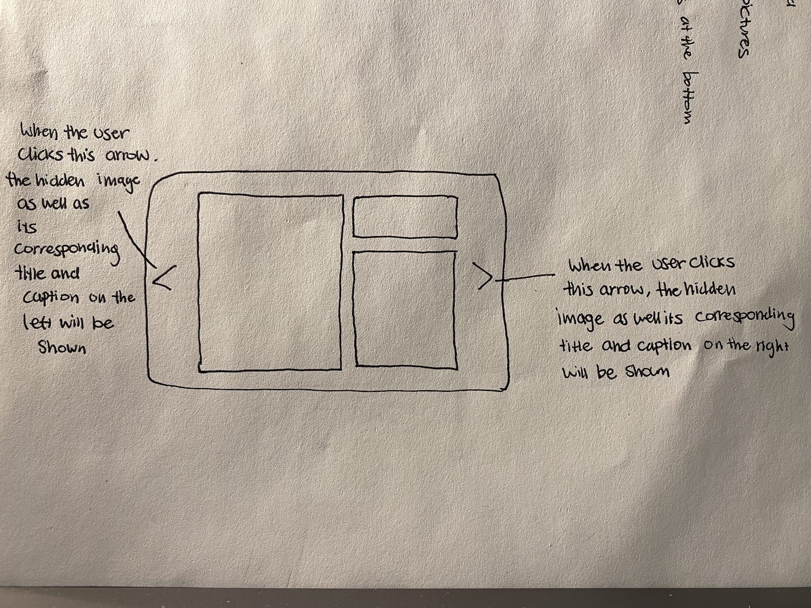
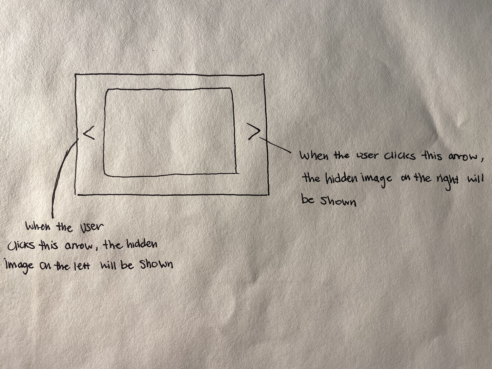
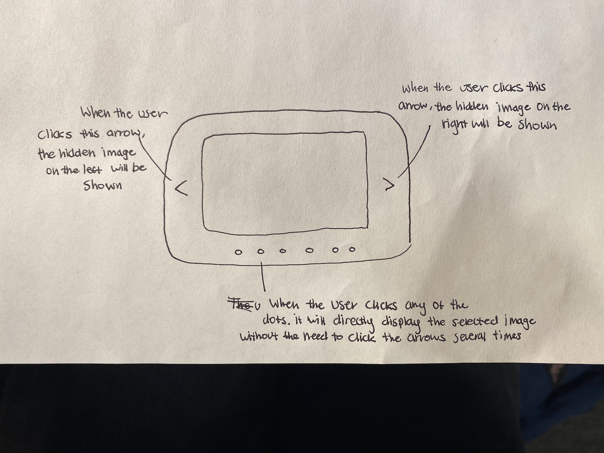
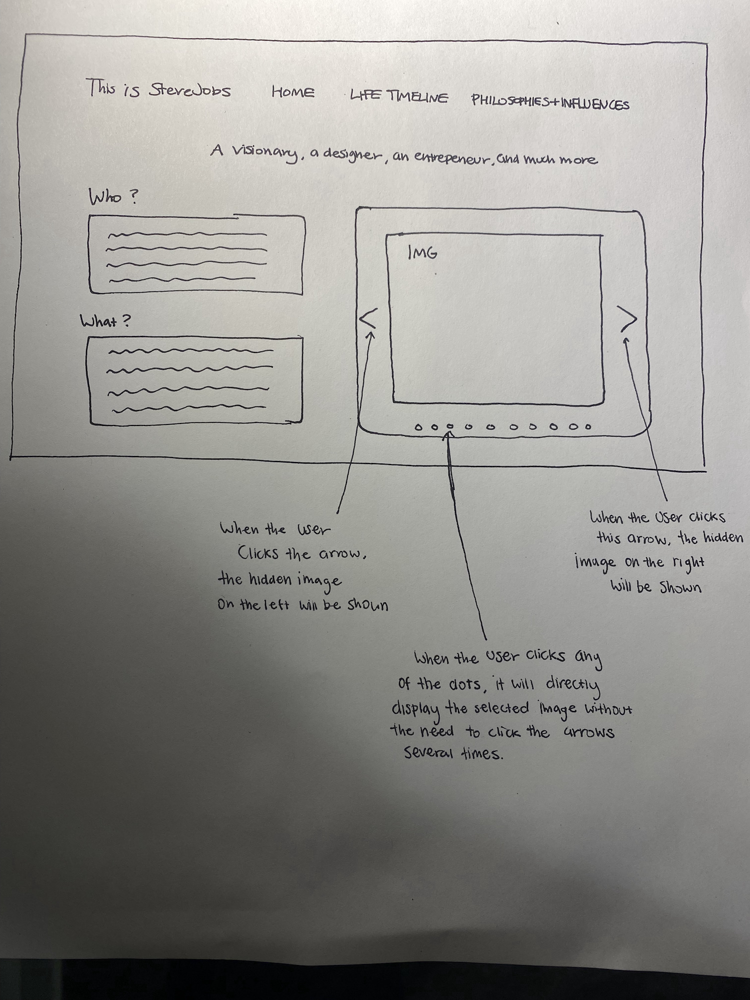

# Project 3: Design Journey

**For each milestone, complete only the sections that are labeled with that milestone.**

**Replace ALL _TODOs_ with your work.** (There should be no TODOs in the final submission.)

Be clear and concise in your writing. Bullets points are encouraged.

**Everything, including images, must be visible in Markdown Preview.** If it's not visible in Markdown Preview, then we won't grade it. We won't give you partial credit either. This is your warning.


# Existing Project

**Tell us about the project you'll be using for Project 3.**

## Project (Milestone 1)
> Which project will you add interactivity to enhance the site's functionality?

Project 1


## Audience (Milestone 1)
> Who is your project site's audience?
> This should be the original audience from Project 1 or Project 2.
> You should adjust the audience if necessary. Just make sure you explain your rationale for doing so here.

I believe there’s nothing more gravitating than learning about someone’s life, especially if it’s someone who was as creative and successful as Steve Jobs. Almost every one of us are more or less affected by the innovations that Jobs brought to our world, both real and digital. Thus, the intended audience of my website is suited for a number of different audiences. The website is a place for any age of audience with the inquisition to learn more about the life of Steve Jobs and how he came to be the person he was. On the other hand, the website is also intended to be an inspiration/stimulation for any college graduates or students who are currently in need of a fresh breath for renovating their own personal creative undertakings. Although these are the intended audiences, I hope that the website can expand beyond and benefit anyone who might come across the website.


## Audience's Goals (Milestone 1)
> List the audience's goals that you identified in Project 1 or 2.
> Just list each goal. No need to include the "Design Ideas and Choices", etc. You may adjust the goals if necessary. However, any changes you make to the goals for this project should be clearly identified and justified.

- To find inspiration/stimulation for those who are in need of a fresh breath for renovating/rethinking their own personal creative undertaking
- Learn more about the life of Steve Jobs and how events/happenings in his life have come to shape not only the person he was but also the design principles he stood by.


# Interactivity Design

## Interactivity Brainstorm (Milestone 1)
> Using the audience goals you identified, brainstorm possible options for interactivity to enhance the functionality of the site while also assisting the audience with their goals.
> Briefly explain idea each idea and provide a brief rationale for how the interactivity enhances the site's functionality for the audience.
> Note: You may find it easier to sketch for brainstorming. That's fine too. Do whatever you need to do to explore your ideas.

- Carousel
    - Main feature of the carousel interactivity is that it exposes users to multiple different contents while being able to maximize space and minimize user path. As the site's intended audience mainly revolves around those who are curious of Jobs's innovation and/or thirsting for different inspiration/stimulation that can spark their own creative endeavors, it can be especially useful in providing many different images. By doing so, the intended audiences will be exposed to many different visual stimulation that can possibly either spark new ideas and/or simply make the content more enjoyable to learn about.  

- Tabs
    - Some pages of the website have a lot of information, especially the page about Steve Job's biography that is divided into Early Life, Middle Life, and Late Life. Although effort has been made to divide up the three sections within the given page utilizing different font size and such, this forces the audience to scroll excessively to see all the content. Thus, by utilizing the tabs interactivity where it divides content into different tabs without the need to refresh, the users are able to focus more on the information without having to be bothered by excessive scrolling. It also allows smoother transition to the upcoming page, which prevents the users from losing their interest/focus by being bothered by endless scrolling.

- Accordion Menu
    - Similar to Tabs interactivity, accordion menu can be useful in that it divides up the content in each webpage into smaller subsections. By doing so, it allows the users to focus on the content without having the distraction of needing to scroll excessively for more content. It differs from Tabs interactivity in a sense that while Tabs allow for navigation between subsections of a page, accordion menu allows the user to navigate through all sections of different pages. Thus, this interactivity could allow for further simplification of each page that will allow the users to really dive into the content and learn and feel inspired by the content without the distraction of other content.


## Interactivity Proposal & Rationale (Milestone 1)
> Make a decision about your site's interactivity. Explain what you plan to implement and where it will go on your site.
> Describe the purpose of your proposed interactivity. Provide a brief rationale explaining how your proposed interactivity addresses the goals of your site's audience.

**Interactivity Proposal:**
I plan to implement carousel interactivity that will display variety of images in the home page.

**User Goals Rational:**
I think carousel is a necessary interactivity design that will improve the experience the audiences have with the website. As previously mentioned, the goals of the site's audience consist of not only to learn about Steve Job's life story and how it consequently shaped Jobs to be the person he was but also to be inspired by the principles and philosophies he also lived by that were shaped by his life events. As the saying "A picture is worth a thousand words" goes, by implementing carousel of different images, it will allow the audience to have a refreshing experience that will add new layers of experiences that won't be feasible with just body of texts. In addition, by having it in the home page, the carousel will serve to not only help provide context as to what the website will be about, but also draw in the audience with the enticing images.

## Interactivity Design Ideation (Milestone 1)
> Now that you've made a decision about the site's interactivity, explore the possible design solutions for the interactivity.
> Sketch several iterations of your interactivity.
> Annotate each sketch explaining what happens when a user takes an action. (e.g. When user clicks this, this happens.)

Iteration 1


Iteration 2


Iteration 3


## Final Interactivity Design (Milestone 1)
> Review your sketches from the previous step and pick your final design.
> Create a _polished_ sketch (it's still a sketch, but with a little more care taken to communicate ideas clearly to the graders) to plan your interactivity.
> **Sketch out the entire page where your interactivity will go.** Add your interactivity to the sketch. Add any annotations to explain what happens when the user takes an action.
> Include as many sketches as necessary to communicate your design (ask yourself, could another 1300 take these sketches an implement my design?)




## "Ambitious" Interactivity Explanation
> In your own words, concisely explain why you believe your interactivity meets the "ambitious" requirement.

The interactivity I want to implement in this project meets the "ambitious" requirement because it challenges me to utilize culmination of content we have learned throughout the semester. For example, not only does it require good understanding in html, css, and javascript in and of itself, but also how the three layers work in conjunction to provide user centered interactivity. In detail, the interactivity requires not only competent skill in elements such as .hidden and .active to have an interactivty that is fully functioning. In addition, the interactivity places emphasis on the four design patterns (affordances, visibility, feedback, and familiarity), which are crucial components that one must be aware of when designing an effective and useful interactivity for the user of the site. Thus, the carousel interativity is ambitious.


## Additional Information (Milestone 1)
> (optional) Include any additional information, justifications, or comments we should be aware of.

TODO


# Interactivity Implementation Plan (Final Submission)

## HTML Interactivity Plan (Final Submission)
> Plan the HTML elements you will use in your interactivity.
> For each element, give its `id=` (if it has one) and any default styling (`class=`)

- carousel <div `class=`"carousel">
- img
  - img1: 
  - img2: 
  - img3: 
  - img4: 
  - img5: 
  - img6: 

- button
  - right-button:  <button `id=`"carousel-right-button" `class=`"arrow right">
  - left-button:  <button `id=`"carousel-left-button" `class=`"arrow left">
  - dot1:  <button `id=`"dot1" `class=`"dots">
  - dot2:  <button `id=`"dot2" `class=`"dots active">
  - dot3:  <button `id=`"dot3" `class=`"dots active">
  - dot4:  <button `id=`"dot4" `class=`"dots active">
  - dot5:  <button `id=`"dot5" `class=`"dots active">
  - dot6:  <button `id=`"dot6" `class=`"dots active">

## CSS Interactivity Plan (Final Submission)
> Plan the CSS classes you will need for your interactivity

- `.dots` - style the dots, default state, provide the users with an alternative method to interact with the carousel, change color
- `.hidden` - hide elements
- `.arrow` - style like an arrow button, similar color as the dot indicators, default state, align them
-`button` - change mouse cursor when hovering over the buttons
- `.dots:hover` - change color when the cursor hovers over the dot indicators
- `.arrow:hover` - change color when the cursor hovers over the arrow buttons
- `.active` - darken the corresponding dot indicator of the image shown on the carousel
- `.carousel-slides` - lay out the images using flexbox
- `.carousel-buttons` - lay out the buttons using flexbox
- `.citations` - lay out citations under the carousel
- `.carousel` - position the carousel in the home page using flexbox


## Interactivity Pseudocode (JavaScript) Plan (Final Submission)
> Write your interactivity pseudocode plan here.

```
When the right arrow button is clicked:
  remove .hidden class from .slide element
  add .hidden class to all the other .slide element

When the left arrow button is clicked:
  remove .hidden class from .slide element
  add .hidden class to all the other .slide element

When the dot status indicator dot1 is clicked:
  remove .active from .dots element
  show the first slide

when the dot status indicator dot2 is clicked:
  remove .active from .dots element
  show the second slide

when the dot status indicator dot3 is clicked:
  remove .active from .dots element
  show the third slide

when the dot status indicator dot4 is clicked:
  remove .active from .dots element
  show the fourth slide

When the dot status indicator dot5 is clicked:
  remove .active from .dots element
  show the fifth slide

```


# Grading (Final Submission)

## Interactivity Usability Justification (Final Submission)
> Explain how your design effectively uses affordances, visibility, feedback, and familiarity.

The design effectively employs affordances through multiple elements, which allow the users to utilize the interactivity. For example, the left and right arrow button as well as the dots located at the bottom are not only responsible for the actual functionality of the interactivity, but also implying the actions/interactions that the users are capable of making. This is also accompanied by pointer cursor and hover, which complement the affordances of the interactivity design. The interactivity design also employs visibility with clear coherent color scheme of the buttons to make the implications of the interactivtiy to the users effective and clear. Additionally, the design also incorporates visibility in a sense that there is an adequate amount of proxmity from other contents on the webpage, which not only helps with the overall structure/simplicity of the page, but more importantly the visibility of the interactivity and its components such as buttons. Furthermore, the dots are an example of how the design incorporates feedback. Depending on what image the user is viewing, the difference in color of the dot shows which corresponding image the user is currently viewing, thus providing feedback. In addition, the color of the buttons as well as the cursor of the mouse change when the user hovers over, providing feedbackt that the user can interact by clicking the buttons. Consequently, the images changing based on the users' interaction is also a clear feedback provided to the users. Lastly, the design also effectively utilizes familiarity in a sense that the interactivity behaves the way it is intended to. The arrow buttons as well as the dots are all familiar elements for users that help guide them how they can interact with the design.


## Additional Design Justifications (Final Submission)
> If you feel like you haven’t fully explained your design choices in the final submission, or you want to explain some functions in your site (e.g., if you feel like you make a special design choice which might not meet the final requirement), you can use the additional design justifications to justify your design choices. Remember, this is place for you to justify your design choices which you haven’t covered in the design journey. Use it wisely. However, you don’t need to fill out this section if you think all design choices have been well explained in the final submission design journey.


## Tell us What to Grade (Final Submission)
> We aren't re-grading your Project 1 or 2. We are only grading the interactivity you added.
> Tell us where (what page) we can find your interactivity and how to use it.
> **We will only grade what you list here;** if it's not listed, we won't grade it.

The interactivity is in "Home" of project 1, on the right hand side. The intended interactivitiy is carousel. One can use the right arrow button in order to see the following images to the right, or click on the left arrow buton to see the previous image on the left. On the other hand, one can also interact with any of the six dots near the bottom of the interactivity, which would directly display the corresponding images without having to click the arrows repetitively.


## Additional Resources/References (Final Submission)
> If you referenced other websites (or sources, including tutorials) on this project, list them here.


## Self-Reflection (Final Submission)
> This was the first project in this class where you coded some JavaScript. What did you learn from this experience?

As I began to feel like I was setting the foundatino of my skills in HTML and CSS, when I was introduced to JavaScript this project, I was a little lost to say the least. For whatever reason, the basic idea/concept was initially a bit difficult for me to wrap my head around as I was little too unfamiliar with it. However, throughout the course of this project, I began to realize that JavaScript adds a whole new layer to not only my knowledge in web development but also skilset in which can help me further explore web design/development. Even though I only got the opportunity to a single interactivity, I learned how much more could be explored later on with more knowledge. In addition, through this project, I learned the importance of organization and planning from the need to not only plan the pseudocode but also how three layers of HTML, CSS, and JavaScript have to be coherent in order for everything to workout successfully.


> Reflect on how HTML, CSS, and JavaScript together support client-side interactivity. If it's helpful, you can describe your mental model of client-side interactivity or explain how the general idea of showing and hiding content can be used to implement other forms of client-side interactivity beyond what you've done in this project.

I think HTML, CSS, and JavaScript are all distinct yet integral parts in supporting client-side interactivity as a whole. At least from my experience in this course, I associate HTML with "what" information is provided for the user. It sets the foundation for what the website will be about while being fully aware of who the intended audience is. For me, CSS, is more in regards to "how" those information provided in HTML will be displayed for the user. Whether that may be functionally or visually, through the use of flexbox or adjusting font families and background colors, CSS is responsible for the emotion and the navigation of the users upon entering the website. Lastly, upon finishing project 3, I got the sense JavaScript is a culmination of these elements in which is responsible for fostering interactivity between the website and the users.


> Take some time here to reflect on how much you've learned since you started this class. It's often easy to ignore our own progress. Take a moment and think about your accomplishments in this class. Hopefully you'll recognize that you've accomplished a lot and that you should be very proud of those accomplishments!

Coming into this course, I was a little intimidated to say the least because I had no prior knowledge regarding coding or web designing, though I'm sure many others felt the same way. Thus, each week from project 1 to 3 was especially stressful because transferring from Architecture, everything I encountered in this course felt extra complex due to my lack of knowledge in this relative field. However, looking back, it's surprising for me to see how well I'm doing in this class not just in terms of how well it's reflected through my grade, but I also get the feeling that I'm actually enjoying what I'm learning. From HTML and CSS to now JavaScript, not only do I feel  more confident in my ability to code and design but I also get the feeling I chose the right program. As this class has given me the opportunity to experience a variety of crucial elements in web design, such as coding, user interview/testing, and many more, I am thoroughly excited for what's to come.
